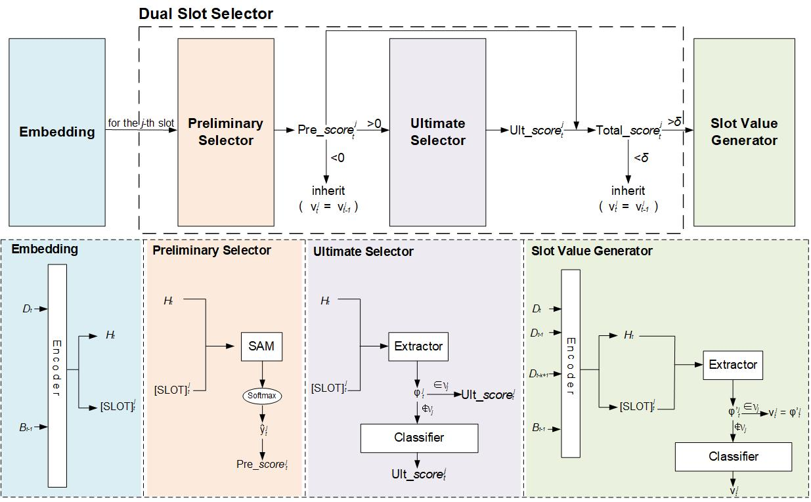

DSSDST
==========

This paper/code introduces the Dual Slot Selector via Local Reliability Verification for Dialogue State Tracking (DSSDST) on the Multi-Domain Wizard-of-Oz dataset (MultiWOZ).

You can find the paper [here](https://arxiv.org/pdf/2107.12578.pdf)

See below for an overview of the model architecture:



  

## Requirements

Our model was trained on GPU Tesla P40 of Nvidia DGX.  

- Python 3 (tested on 3.6.8)

- PyTorch (tested on 1.6.0)

- CUDA (tested on 10.1)

- transformers (tested on 2.1.0)


We have released the trained model and output of each training turn. You can find the [output](https://github.com/guojinyu88/DSSDST/blob/master/data/mwz2.2/cls_score_test_turn1.json) under the data directory and the [models](https://drive.google.com/file/d/1kHZQbwwhk7_r2RzIlc3dRvDoQsyJz8FE/view?usp=sharing) on the Google Drive(Due to the file limit, we do not released the model in this repo)

## Download and Preprocessing data

To download the MultiWOZ dataset and preprocess it, please run this script first.<br>
You can choose the version of the dataset. ('2.1', '2.0', '2.2')<br>
The downloaded original dataset will be located in `$DOWNLOAD_PATH`, and after preprocessing, it will be located in `$TARGET_PATH`.
```
python3 create_data.py --main_dir $DOWNLOAD_PATH --target_path $TARGET_PATH --mwz_ver '2.1' # , '2.0' # or '2.2'
```

## Training

  

To train the model of preliminary slot selector, you can run:

```
bash train_model_turn0.sh
```

To train the model of Ultimator slot selector, you can run:

```
bash train_model_turn1.sh
```

To train the model of slot value generator, you can run:

```
bash train_model_turn2.sh
```

All model checkpoints and the temporary outputs will be saved to `./saved_models/`.


## Evaluation

To reproduce the performance as we report in the paper, you can download the trained model from Google Drive and run the evaluation script:

```
bash eval_model.sh
```

## Citation

```
@inproceedings{guo-etal-2021-dual,
    title = "Dual Slot Selector via Local Reliability Verification for Dialogue State Tracking",
    author = "Guo, Jinyu  and
      Shuang, Kai  and
      Li, Jijie  and
      Wang, Zihan",
    booktitle = "Proceedings of the 59th Annual Meeting of the Association for Computational Linguistics and the 11th International Joint Conference on Natural Language Processing (Volume 1: Long Papers)",
    month = aug,
    year = "2021",
    address = "Online",
    publisher = "Association for Computational Linguistics",
    url = "https://aclanthology.org/2021.acl-long.12",
    doi = "10.18653/v1/2021.acl-long.12",
    pages = "139--151",
    abstract = "The goal of dialogue state tracking (DST) is to predict the current dialogue state given all previous dialogue contexts. Existing approaches generally predict the dialogue state at every turn from scratch. However, the overwhelming majority of the slots in each turn should simply inherit the slot values from the previous turn. Therefore, the mechanism of treating slots equally in each turn not only is inefficient but also may lead to additional errors because of the redundant slot value generation. To address this problem, we devise the two-stage DSS-DST which consists of the Dual Slot Selector based on the current turn dialogue, and the Slot Value Generator based on the dialogue history. The Dual Slot Selector determines each slot whether to update slot value or to inherit the slot value from the previous turn from two aspects: (1) if there is a strong relationship between it and the current turn dialogue utterances; (2) if a slot value with high reliability can be obtained for it through the current turn dialogue. The slots selected to be updated are permitted to enter the Slot Value Generator to update values by a hybrid method, while the other slots directly inherit the values from the previous turn. Empirical results show that our method achieves 56.93{\%}, 60.73{\%}, and 58.04{\%} joint accuracy on MultiWOZ 2.0, MultiWOZ 2.1, and MultiWOZ 2.2 datasets respectively and achieves a new state-of-the-art performance with significant improvements.",
}
```
